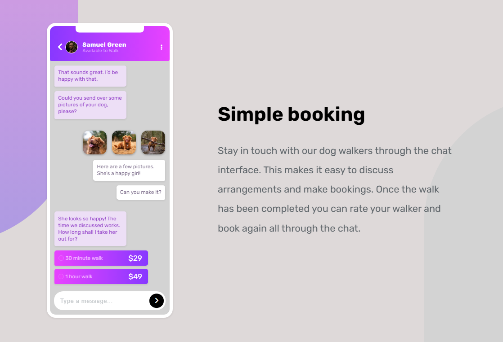

# Frontend Mentor - Chat app CSS illustration solution

This is a solution to the [Chat app CSS illustration challenge on Frontend Mentor](https://www.frontendmentor.io/challenges/chat-app-css-illustration-O5auMkFqY). Frontend Mentor challenges help you improve your coding skills by building realistic projects.

### Screenshot

- Live Site URL: https://taavi80.github.io/chat-app-css-illustration/

## My process

### Built with

- Semantic HTML5 markup
- Mobile-first workflow

## Author

- Website - [taavi80](https://www.frontendmentor.io/profile/taavi80)
